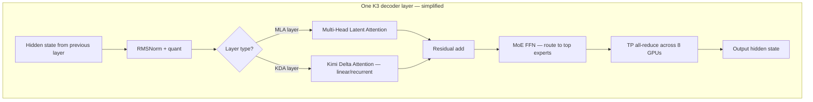
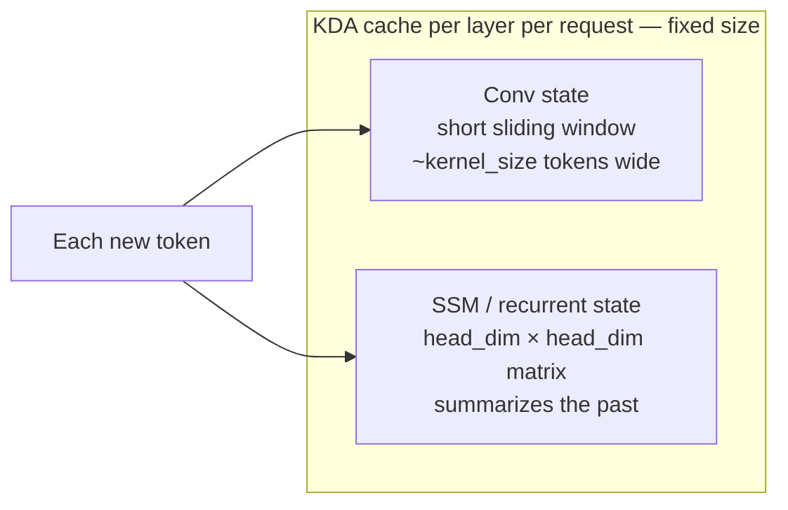
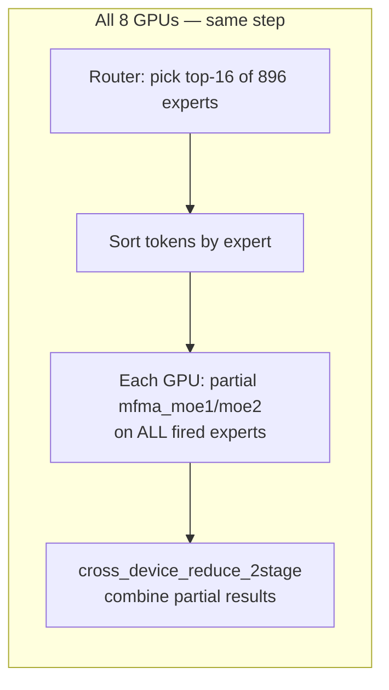
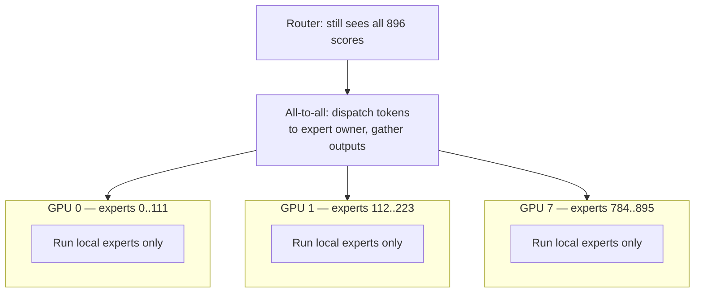
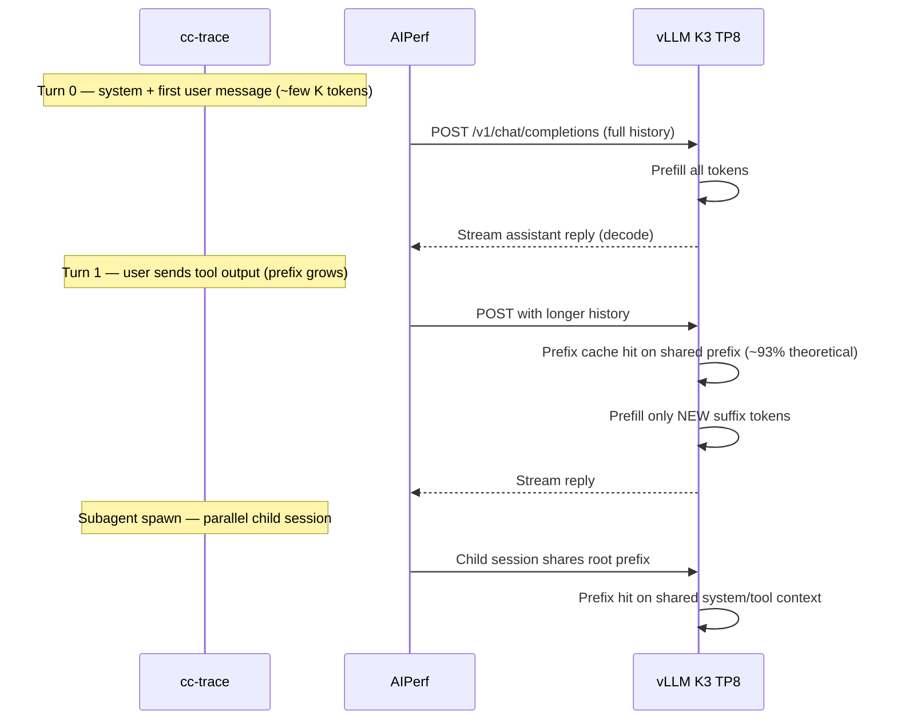

# Kimi-K3 for Complete Beginners — Algorithm, Kernels, and Agentic Traces

This tutorial explains **what Kimi-K3 (K3) is**, **how one request flows through it**, and **what each GPU kernel in our traces is doing**. It uses:

- our **agentic trace replay** (`cc-traces-weka-062126`) as the workload story,
- our **MI355X profiler captures** in [`kimik3_traces/`](../kimik3_traces/) as the kernel reference,
- and the existing deep-dive docs linked at the end.

No prior knowledge of MoE, MLA, or vLLM is assumed.

---

## Part 0 — The smallest possible picture

An LLM is a function:

```
tokens in  →  tokens out
```

Serving splits that into two phases:

| Phase | What happens | User-visible metric |
|---|---|---|
| **Prefill** | Read the whole prompt (system + history + new user message) | **TTFT** (time to first token) |
| **Decode** | Generate the answer one token at a time | **TPOT** (time per output token) |

**Kimi-K3** is a very large model (~**2.8 trillion** parameters, **896** experts, **93** layers) built for long agentic conversations (native **1M** context on B300; we cap at **64K** on MI355X for a capture bug — see [kimik3_mi355x_agentic_baseline.md](kimik3_mi355x_agentic_baseline.md)).

Our agentic benchmark replays real coding-agent sessions: multi-turn chat, tool calls, subagents. Average input is **~40K tokens** per turn on MI355X; **~93%** of those tokens theoretically share a prefix with earlier requests in the same trace (prefix-cache metric).

---

## Part 1 — What makes K3 different from a “normal” transformer

A classic decoder-only transformer repeats the same block 80–128 times:

```
for each layer:
    Attention  →  MLP (or MoE)  →  residual
```

K3’s block is **hybrid** and **sparse**:



Three ideas to remember:

1. **Not every layer uses the same attention.** Some layers are **MLA** (standard-ish attention with compressed KV). Others are **KDA** (linear attention with a **recurrent state**, not paged KV).
2. **The FFN is MoE**, not one big dense matrix. A **router** picks a few experts per token; only those experts run.
3. **The model is tensor-parallel (TP8)** on one node — each GPU holds ⅛ of the weights; after each layer, GPUs **all-reduce** partial results. MoE experts use **TP sharding** by default (not Expert Parallel); see **Part 3b** for the EP alternative.

---

## Part 2 — MLA vs KDA (the two attention “species”)

Think of attention as: *each new token asks questions about all previous tokens.*

### MLA — Multi-Head Latent Attention (dense)

- Used on **~24 “full attention” layers** in K3 (exact indices come from `linear_attn_config.full_attn_layers` in the model config).
- Stores **KV cache in GPU memory** as **paged blocks** (like normal vLLM KV cache).
- **Compresses** keys/values into a smaller “latent” form (head dims **192 / 128** in our FMHA kernel names).
- **Benefits from prefix caching**: if turn 5 shares the same prompt prefix as turn 4, vLLM can reuse MLA KV blocks for the shared part.

**Kernels you’ll see (from `kimik3_traces/profiler_out_0.txt`):**

| Kernel | Phase | Plain English |
|---|---|---|
| `aiter::fmha_fwd_hd192_hd128_bf16_causal_group` | Prefill | Flash attention over the whole new prompt chunk |
| `aiter::fmha_fwd_hd192_hd128_bf16_group` | Prefill | Non-causal / grouped variant |
| `_mla_gluon` | Decode | Batched MLA decode (one new token vs cached KV) |
| `merge_attn_states` | Both | Combine partial attention results (e.g. split-KV paths) |
| `_attn_res_kernel` | Both | Residual / output projection around attention |
| `vllm::unified_mla_attention_with_output` | Both (CPU) | vLLM wrapper — **runs eager**, breaks CUDA graphs |

On MI355X fp8 agentic we force **`TRITON_MLA`** for batched fp8 decode (AITER gluon fp8 only supports batch=1).

### KDA — Kimi Delta Attention (linear / recurrent)

- Used on the **other layers** (`linear_attn_config.kda_layers`).
- **Does not store paged KV** like MLA. Instead it keeps a **fixed-size recurrent state** (like a compressed memory of the past).
- Each new token **updates** that state — you cannot “prefix-cache” it the same way as MLA blocks.
- Cheaper per token at very long context, which is why K3 mixes MLA + KDA.

**Kernels you’ll see:**

| Kernel | Plain English |
|---|---|
| `chunk_gated_delta_rule_fwd_kernel_h_blockdim64` | Main KDA “delta rule” chunk forward |
| `chunk_kda_fwd_kernel_intra_sub_chunk` | Sub-chunk work inside KDA |
| `chunk_gla_*` | Gated linear attention pieces |
| `_causal_conv1d_fwd_kernel` | Local 1D conv over the sequence (short memory) |
| `kda_gate_*`, `fused_recurrent_kda_*` | Gating + recurrent decode updates |

From our TP8 profile ([kimik3_tp8_rank_imbalance.md](kimik3_tp8_rank_imbalance.md)), KDA is **~5–6%** of GPU time in an 8k-prefill window — smaller than MLA or MoE, but present on **every** forward pass through KDA layers.

### Hybrid KV manager

Because MLA and KDA need **different memory layouts**, K3 requires vLLM’s **hybrid KV cache manager** (`--no-disable-hybrid-kv-cache-manager`). Without it, vLLM tries to pad layers and you get init/capture errors.

**Rule of thumb:**

| Layer type | Memory | Prefix cache? |
|---|---|---|
| MLA | Paged KV blocks | **Yes** (main win on agentic traces) |
| KDA | Recurrent state | **No** (state still must be updated each turn) |

### Part 2b — Cache dtypes: what `--kv-cache-dtype fp8` actually changes

A common confusion on K3: **“we turned on fp8 KV — is everything in fp8 now?”**  
**No.** K3 has **two different cache systems** with **two different vLLM flags**. They do not follow each other.

#### Two memories, two flags

| Cache | What it stores | Grows with context? | vLLM flag | Our agentic recipe |
|---|---|---|---|---|
| **MLA paged KV** | Compressed keys/values for full-attention layers | **Yes** — one entry per past token | `--kv-cache-dtype` | **`fp8`** |
| **KDA state** | Conv window + recurrent SSM matrix per KDA layer | **No** — fixed size per request | `--mamba-cache-dtype` / `--mamba-ssm-cache-dtype` | **not set** (`auto`) |

Our MI355X recipe only passes `--kv-cache-dtype fp8` ([`kimik3_fp4_mi355x_vllm.sh`](../benchmarks/single_node/agentic/kimik3_fp4_mi355x_vllm.sh)). It does **not** pass `--mamba-cache-dtype`. Server metrics from `k3_sweep_c*` confirm: `cache_dtype=fp8` but `mamba_cache_dtype=auto`.

#### What is inside KDA state? (conv bf16, SSM fp32)

KDA keeps **two** tensors per layer per request — not “KV” in the MLA sense:



| Piece | Role | Storage dtype (vLLM default) | Analogy |
|---|---|---|---|
| **Conv state** | Local short memory (`_causal_conv1d` kernels) | **bf16** (`mamba_cache_dtype=auto` → model dtype) | A tiny “recent tokens” buffer |
| **SSM state** | Long-range recurrent memory (`fused_recurrent_kda`, delta rule) | **fp32** (hardcoded in vLLM for KDA numerics) | A fixed-size “summary matrix” of everything so far |

Important details:

1. **Size does not scale with 40K / 68K context** the way MLA KV does. Whether the conversation is 8K or 64K tokens long, each KDA layer still holds **one conv slab + one SSM matrix** per request. Long context is “folded into” the SSM update, not stored as a growing token list.
2. **vLLM cannot store KDA in fp8 today.** `MambaDType` only allows `auto | float32 | float16 | bfloat16` — no fp8 path for mamba/KDA cache.
3. **Turning on MLA fp8 does not change KDA dtypes at all.**

#### Why the fp8 win is mostly MLA KV **bandwidth**, not KDA memory

At **decode**, each new output token must **read** whatever attention memory that layer uses, then write updates.

**MLA layers (~24 of 93):**

- Memory **grows with sequence length** \(L\): roughly “bytes per token × L” per MLA layer.
- At **68K context**, bf16 MLA KV is huge → decode becomes **memory-bandwidth bound** (reading all that KV every token). Reference bf16 runs show **~100–110 ms TPOT** at 68K input ([kimik3_ref_config_vs_ours.md](kimik3_ref_config_vs_ours.md)).
- **fp8 MLA KV ≈ half the bytes** → roughly half the KV **read traffic** per decode step → faster TPOT on MLA-heavy decode (when capture/context limits allow it).

**KDA layers (the rest):**

- Memory is **fixed per request** (conv bf16 + SSM fp32), **not** “one slot per past token.”
- fp8 MLA does **not** shrink this footprint — KDA dtypes stay conv **bf16** + SSM **fp32** either way.
- KDA is also a **smaller slice of GPU time** (~5–6% in our profiles) than MLA + MoE, so even a hypothetical future fp8 KDA would move the needle less than MLA KV at long context.

```text
Decode cost picture (simplified):

  MLA layer:  READ  [====KV grows with context====]  → fp8 helps a lot at long L
  KDA layer:  READ  [conv bf16][SSM fp32]           → fixed size; fp8 flag ignores this
```

**Prefix caching** is another MLA-only story: when turn N shares a prefix with turn N−1, vLLM **reuses MLA KV blocks** for the shared tokens. KDA state still **must be updated** for the new tokens — there is no equivalent “reuse the whole KDA block” win.

#### bf16 vs fp8 serve — what actually differs on MI355X

| | Reference (bf16 MLA) | Our agentic (fp8 MLA) |
|---|---|---|
| MLA KV storage | bf16 | **fp8** |
| KDA conv | bf16 | bf16 (unchanged) |
| KDA SSM | fp32 | fp32 (unchanged) |
| Max context | native (~1M) | **64K cap** (capture bug workaround) |
| Decode backend | AITER gluon (bf16) | **TRITON_MLA** (fp8 batched) |

So the trade-off documented in [kimik3_ref_config_vs_ours.md](kimik3_ref_config_vs_ours.md) is real:

- **bf16 MLA** → full context, slower decode (big KV reads).
- **fp8 MLA** → faster MLA decode bandwidth, but capped context + different backend until the ≥128K cudagraph capture bug is fixed.

Neither path quantizes KDA cache today.

#### One-sentence summary

**`--kv-cache-dtype fp8` speeds up long-context decode by halving MLA KV traffic; KDA keeps conv in bf16 and recurrent state in fp32, fixed-size, untouched by that flag.**

---

## Part 3 — MoE — how 896 experts become a few matrix multiplies

K3’s feed-forward is **Mixture-of-Experts (MoE)**:

1. **Router** (`grouped_topk_kernel`) scores all 896 experts; picks **top-16** (typical in our traces).
2. **Sort / pack** tokens by expert (`opus_moe_sorting`, `mxfp4_moe_sort`) so each expert runs one batched GEMM.
3. **Expert GEMM 1** — up-projection + SiLU (`mfma_moe1_silu_mul_afp8_wfp4_…`).
4. **Expert GEMM 2** — down-projection (`mfma_moe2_afp8_wfp4_bf16_cshuffle_…`).
5. **Combine** weighted expert outputs (`moe_reduction_kernel_plain_bf16_topk16_…`).

Weights are **MXFP4** (4-bit); activations are often **FP8** on the fast path → kernel names say `afp8_wfp4`.

**One MoE layer ≈ one `fused_moe_` call** in the profiler (~5,336 calls in our rank0 window ≈ many layers × many forward steps).

Shared experts (always-on) plus routed experts are fused inside `vllm::moe_forward_shared` / `aiter::fused_moe_`.

---

## Part 3b — Expert Parallelism (EP): how K3's 896 experts get placed on GPUs

This section explains **Expert Parallelism (EP)** — a different way to spread MoE weights across GPUs — and why **our MI355X agentic baseline uses TP8 without EP**.

### Two ways to parallelize a MoE layer

K3 has **896 routed experts** per MoE layer (plus **shared experts** that always run). On **8 GPUs**, vLLM can place those experts in two fundamentally different ways:

| | **Tensor Parallel (TP) — what we run** | **Expert Parallel (EP) — optional flag** |
|---|---|---|
| **Idea** | Split **each expert's weight matrix** across 8 GPUs | Split **which experts live on which GPU** |
| **Per GPU owns** | ⅛ of **every** expert's weights | **112 full experts** (896 ÷ 8), zero of the others |
| **When token picks expert #417** | All 8 GPUs do partial matmul on expert 417, then **all-reduce** | Only the GPU that **hosts** expert 417 runs the full matmul |
| **MoE comm pattern** | All-reduce after MoE (`cross_device_reduce_2stage`) | **All-to-all** — send tokens to the GPU that owns the target expert, gather results back |
| **vLLM flag** | Default (no flag) | `--enable-expert-parallel` |
| **Attention layers** | TP8 sharded | Still TP8 sharded (EP only changes MoE) |

Think of it like a restaurant kitchen:

| Mode | Analogy |
|---|---|
| **TP** | Every cook holds ⅛ of every recipe. Any order requires all 8 cooks to collaborate on each dish, then combine. |
| **EP** | Each cook masters 112 full recipes. When an order names expert #417, the ticket is **routed to the cook who owns #417**. Cooks swap tickets (all-to-all) instead of all working on every dish. |

### What happens step-by-step: TP8 MoE (our traces)

This is what you see in `kimik3_traces/` today — **no EP**:



1. **Router** runs on each GPU (gate weights are replicated): score 896 experts, pick **top-16** per token.
2. **Sort** tokens into expert batches (`opus_moe_sorting`, `mxfp4_moe_sort`).
3. **Expert GEMM**: each GPU holds **1/8 of each expert's** MXFP4 weights → partial matmuls for every expert that fired.
4. **All-reduce** (`cross_device_reduce_2stage`) combines the 8 partial results → full output hidden state.

Every GPU does work for **every** expert selected by **any** token in the batch. That is why MoE + AR together dominate the profile.

### What would change with EP8 on the same 8 GPUs

If you added `--enable-expert-parallel` with `--tensor-parallel-size 8` (and no data parallel):



Per vLLM's MoE config (`FusedMoEParallelConfig`): when EP is on, **`ep_size = tp_size`** and expert weights are **no longer tensor-sharded** — each rank stores complete expert matrices for its slice of the 896.

| Step | EP behavior |
|---|---|
| Router | Same — scores all 896 experts globally, picks top-16 |
| Dispatch | **All-to-all** sends each token to the GPU(s) that own the selected experts |
| Expert GEMM | Each GPU runs matmuls **only for its ~112 local experts** |
| Combine | **All-to-all** (or reduce-scatter / all-gather) sends results back to the originating token's GPU |
| Shared experts | Still run on every rank (fused in `moe_forward_shared`) |

You would **not** see the same `cross_device_reduce_2stage` pattern after MoE — you'd see **all-to-all** kernels instead (backend-dependent: `allgather_reducescatter`, DeepEP, FlashInfer NVLink, etc.).

### Does EP balance experts across partitions?

**Two different things — don't confuse them:**

| Question | Answer |
|---|---|
| Does each GPU get the **same number of experts**? | **Yes** — EP statically divides the 896 experts evenly |
| Does each GPU get the **same amount of work** (tokens)? | **No, not automatically** — routing is dynamic; hot experts skew load |

**Static placement (always on with EP):** vLLM assigns experts to ranks up front. For K3 with EP8:

```
896 experts ÷ 8 ranks = 112 experts per GPU

Rank 0: experts   0 – 111   (linear placement — default)
Rank 1: experts 112 – 223
...
Rank 7: experts 784 – 895
```

If 896 were not divisible by EP size, the first `remainder` ranks get one extra expert each (same formula as `expert_map_manager.py`).

**Dynamic token load (not balanced by default):** the router still picks **top-16 of 896 per token**. On a real agentic trace, some experts are hit far more often than others. With linear placement, if traffic clusters on experts 0–50, **rank 0 is overloaded** while rank 7 sits idle — even though both own exactly 112 experts.

```
Static:     each rank owns 112 experts     ✓ balanced
Runtime:    tokens per rank this step      ✗ can be very skewed
```

Under **TP8 (no EP)**, skew is a different problem: every rank does partial work on **all** fired experts, then waits at the all-reduce barrier for the slowest rank (the spin-wait we measured in [tp8 rank imbalance](kimik3_tp8_rank_imbalance.md)).

**EPLB (optional load balancer):** vLLM's **`--enable-eplb`** (Expert Parallel Load Balancer) watches token counts per expert over a sliding window and **periodically moves expert weights** between ranks to even out load. It is separate from `--enable-expert-parallel` — EP places experts; EPLB rebalances them over time.

| Flag | What it does |
|---|---|
| `--enable-expert-parallel` | Static even **count** split across ranks |
| `--enable-eplb` | Dynamic **workload** rebalance (moves hot experts toward idle ranks) |

EPLB adds memory overhead (optional **redundant expert** copies) and periodic weight migration cost. It is aimed at large-scale NVIDIA EP deployments (DeepSeek-class); it is **not** in our K3 MI355X recipe.

**K3 takeaway:** EP8 gives each MI355X GPU 112 full experts — balanced **storage**, not balanced **traffic**. For agentic conc 4, TP8 avoids the all-to-all dispatch problem entirely; the remaining skew is cross-rank spin-wait at the TP all-reduce, which our traces show is modest at decode (0.3% end-to-end imbalance).

---

EP is most useful **with Data Parallel (DP)** across many GPUs or nodes. vLLM defines:

```
EP_SIZE = TP_SIZE × DP_SIZE
```

Example from the [vLLM EP docs](https://docs.vllm.ai/en/latest/serving/expert_parallel_deployment.html): `TP=2, DP=4` on 8 GPUs → expert layers form an **EP group of 8**, attention uses **TP=2 within each DP replica**.

For K3 this matters at scale:

| Deployment | Typical parallel layout | Why |
|---|---|---|
| **Our MI355X agentic** | **TP8, EP off** | ~1.5 TB checkpoint fits one 8× MI355X node; recipe validated |
| **MAD day-0 / SGLang K3** | **TP8, EP off** | Same single-node profile |
| **B200 Dynamo aggregated** | **TP8 × PP2** (2 nodes, 16 GPUs) | Checkpoint too large for one node; pipeline-parallel splits **layers**, not experts |
| **Wide EP (future)** | TP=1, DP=N, **EP=N** | Many nodes; each GPU owns a thin slice of the 896 experts — throughput play |

InferenceX's B200 Kimi-K3 Dynamo bring-up uses **aggregated TP8×PP2**, not EP — pipeline parallel splits the 93 **layers** across nodes, while MoE inside each stage still uses **TP** within the 8-GPU stage.

### What stays TP even when EP is on

EP **only** changes MoE expert weight placement. These stay tensor-parallel (or replicated):

| Component | Parallelism with EP enabled |
|---|---|
| MLA / KDA attention | **TP** (same as today) |
| Dense projections (`Cijk_` GEMMs) | **TP** |
| Router gate (`grouped_topk`) | Replicated (each rank scores all 896) |
| Embeddings / lm_head | **TP** |
| TP all-reduce after attention + dense | **Unchanged** |

So EP is **not** a free lunch — you trade MoE all-reduces for MoE all-to-all, while attention comm stays.

### Why we don't use EP on MI355X agentic (today)

| Reason | Detail |
|---|---|
| **Recipe default** | `kimik3_fp4_mi355x_vllm.sh`, MAD `default.yaml`, and SGLang K3 all use **`-tp 8` without `--enable-expert-parallel`** |
| **Single node fits** | K3 MXFP4 checkpoint (~1.5 TB) fits **8× MI355X** with TP8 — no need to spread experts across extra nodes |
| **Agentic = latency-sensitive** | EP shines at **high concurrency / multi-node throughput**; our baseline optimizes **TTFT / TPOT** at conc 4 |
| **All-to-all overhead** | At low batch (agentic decode), dispatching 16 experts × few tokens via all-to-all can lose to a well-tuned TP path + AITER custom AR |
| **ROCm EP maturity** | vLLM EP docs focus on DeepEP / FlashInfer NVLink backends (NVIDIA multi-node). MI355X day-0 path is **AITER TP MoE** (`mfma_moe*`), not EP all-to-all |

This is **not** saying EP is wrong for K3 — it is saying **our current traces and baselines are TP-only**, and that is the right default for single-node agentic bring-up.

### When EP would be worth trying on K3

| Scenario | EP might help |
|---|---|
| **Multi-node serving** (2+ nodes, 16+ GPUs) | Spread 896 experts across more GPUs; reduce per-GPU MoE memory |
| **Very high concurrency** (conc 128–256+) | Expert locality — each GPU only computes ~112 experts instead of partial work on all 896 |
| **Wide EP on MI355X cluster** | Similar to DSV4 `TP=4/EP=4` throughput arms in InferenceX — needs validated all2all backend on ROCm |
| **Memory headroom** | EP stores **full** expert weights (not ⅛-sharded) but **fewer** of them per GPU — tradeoff depends on expert size vs count |

### K3-specific MoE facts that affect EP

| Property | K3 value | EP implication |
|---|---|---|
| Routed experts | **896** | EP8 → **112 experts/GPU**; EP16 → 56/GPU |
| Top-k | **16** per token | Up to 16 distinct dispatch targets per token → all-to-all fanout |
| Grouped top-k | Yes (`use_grouped_topk`) | Router first picks expert **groups**, then experts within groups |
| Weight format | **MXFP4** (4-bit) | AITER `afp8_wfp4` flydsl path in TP mode; EP path must use an EP-capable MoE backend |
| Shared experts | Yes (`num_shared_experts > 0`) | Always run locally on every rank — not dispatched |
| MoE layers | Most of 93 layers (after `first_k_dense_replace`) | EP comm happens **per MoE layer** × every forward step |

### Quick comparison to DSV4 (for context)

DSV4-Pro is the model where InferenceX has invested heavily in **EP + DP-attention + DeepEP** on B200/B300. K3 differs:

| | **DSV4-Pro** | **Kimi-K3** |
|---|---|---|
| Experts | 256 routed (+ sparse MLA) | **896** routed (+ shared) |
| Attention | Sparse MLA | **Hybrid MLA + KDA** |
| Our MI355X default | TP8 (EP arms exist for throughput) | **TP8 only** |
| Multi-node | EP + disagg common | **PP2 aggregated** (B200 Dynamo), EP not in agentic recipe |

### How to turn EP on (if experimenting)

Not our production recipe — for lab use only:

```bash
vllm serve moonshotai/Kimi-K3 \
  --tensor-parallel-size 8 \
  --enable-expert-parallel \
  --all2all-backend allgather_reducescatter   # default; or deepep_* on NVIDIA multi-node
  # ... rest of K3 flags ...
```

Expect different kernels in the profiler: **all-to-all** replaces some MoE **all-reduce** volume, but attention AR is unchanged. Validate output quality before trusting throughput numbers — EP misconfiguration has produced garbage tokens on other MI355X MoE models in past sweeps.

See also: [vLLM Expert Parallel Deployment](https://docs.vllm.ai/en/latest/serving/expert_parallel_deployment.html).

---

## Part 4 — Dense GEMM — the “boring” 22% that isn’t MoE

Not everything is MoE. Attention projections, router MLPs, and some dense layers use **bf16 matrix multiply** via **hipBLASLt**:

```
Cijk_Alik_Bljk_BBS_BH_Bias_HA_S_SAV_UserArgs_MT224x256x64…
```

That `Cijk_…` family is **~22%** of GPU time in our conc32 8k profile ([kimik3_fp4_mi355x_conc32_vllm_profile.md](kimik3_fp4_mi355x_conc32_vllm_profile.md)). These are **not** the FP4 expert weights — they’re bf16 projections around attention and MoE.

---

## Part 5 — Communication — why TP8 shows up as 34% in prefill profiles

K3 is **TP8**: each GPU holds ⅛ of the weights; after partial matmuls the GPUs **all-reduce** to combine activations. This is the **TP communication pattern** — if Expert Parallel were enabled (Part 3b), MoE layers would use **all-to-all** instead, but attention and dense layers would still all-reduce.

Our trace’s #1 kernel:

```
aiter::cross_device_reduce_2stage<bf16,8>   ~34% CUDA time
vllm::all_reduce
```

That is **AITER custom all-reduce** (2-stage), not NCCL, on MI355X.

**Important nuance:** 34% is **inflated** in the 8k-prefill profile because prefill has large activation tensors → big all-reduces. In steady **decode**, comm share drops (see caveat in the profile doc). Also, some “idle before AR” is CPU launch bubble from CUDA graphs (next section), not pure network.

---

## Part 6 — Reading our trace files (`kimik3_traces/`)

### What’s in the folder

| File | What it is |
|---|---|
| `profiler_out_0.txt` … `profiler_out_7.txt` | Human-readable **top kernels by CUDA time** (one file per TP rank) |
| `dp0_pp0_tp{N}_…rank{N}.pt.trace.json.gz` | Full **Chrome trace** (gzip JSON) — every kernel launch, CPU ops, gaps |
| `smci355-…async_llm….pt.trace.json.gz` | Extra async-LLM trace |

These were captured on **MI355X TP8**, vLLM, **conc32**, **8k input / 64 output** (short output because full OSL crashes trace export — kernel *names* still match production decode).

### How to read `profiler_out_0.txt`

Columns: `Name | Self CUDA % | CUDA total | # of Calls`

Top of rank 0 (abridged):

| Rank | Kernel | ~CUDA % | Calls | Component |
|---:|---|---:|---:|---|
| 1 | `cross_device_reduce_2stage` | 33.5% | 29k | TP comm |
| 2 | `aten::mm` / `Cijk_…` | ~20% | 47k / 21k | Dense GEMM |
| 3 | `aiter::fused_moe_` | 16.4% | 5k | MoE wrapper |
| 4 | `mfma_moe1…` / `mfma_moe2…` | 8.9% / 5.5% | 5k each | MoE matmuls |
| 5 | `_attn_res_kernel` | 4.0% | 22k | MLA residual |
| 6 | `_mla_gluon` | 2.5% | 2.7k | MLA decode |
| 7 | `chunk_gated_delta_rule…` | 2.1% | 4k | KDA |
| 8 | `execute_context_*_generation_*` | ~1.8% each | 1 | **CUDA graph replay** |

The `execute_context_2(4078)_generation_18(18)` lines are **whole decode steps replayed as one graph** — vLLM captured a fixed batch shape (e.g. 18 concurrent sequences) and replays it with one launch.

### Prefill vs decode in the same trace

| Signal | Prefill | Decode |
|---|---|---|
| Long `unified_mla_attention_with_output` on CPU | ✓ big (~35–60 ms gaps) | smaller |
| `fmha_fwd_hd192_hd128` | ✓ dominates attention | rare |
| `_mla_gluon` | some | ✓ dominates MLA |
| `execute_context_*` graph replays | fewer | many (one per decode batch shape) |
| MoE / AR | both, but AR bigger when activations are wide |

Agentic **turn 10** with 45K input: mostly **prefill** → TTFT dominated by FMHA + dense GEMM + MoE. **Turn 10 response** (~200 tokens): mostly **decode** → `_mla_gluon`, KDA recurrent kernels, MoE, smaller AR.

---

## Part 7 — Agentic traces as the algorithm reference

### Where the traces come from

Dataset: **`semianalysisai/cc-traces-weka-062126`** (393 conversations for K3).

Each file is a **real Claude Code session** re-encoded for replay:

- Multi-turn **chat** (user ↔ assistant)
- **Tool calls** (read file, run command, …)
- **Subagents** — parent spawns helper agents, later **joins** their results

AIPerf scenario: `--scenario inferencex-agentx-mvp`.

### One conversation, step by step



**Key replay rules** (why our numbers are comparable to B300):

1. **Warmup:** Before measuring, replay mid-trace turns to fill prefix cache (25–75% into each trajectory).
2. **Cache-bust marker:** First turn of each recycled play gets a unique `[rid:…]` prefix so infinite replays don’t fake 100% hit rate.
3. **Timing:** Original inter-turn delays preserved (with 10s global idle cap).
4. **Concurrency 4:** Four independent session trees in flight (root + subagents count as separate trees).

### Map metrics → what the model did

From [kimik3_mi355x_agentic_baseline.md](kimik3_mi355x_agentic_baseline.md):

| Metric | What it measures | Kernel-heavy phase |
|---|---|---|
| TTFT p50 **569 ms** | First output token after ~45K input | MLA FMHA prefill, MoE, GEMM |
| TPOT p50 **22 ms** | Each subsequent output token | `_mla_gluon`, KDA recurrent, MoE, AR |
| Prefix-cache hit **93.4%** | Trace structure (theoretical) | Skips MLA prefill on shared prefix |
| Interactivity **47.7 tok/s/user** | Output speed per concurrent user | Mostly decode kernels |

---

## Part 8 — One full forward pass (decode, one token, one layer)

Here is the **decode** path for **one new token** through **one layer**, in order:

```
1. RMSNorm + quant          →  add_rmsnorm_quant_kernel
2. Attention (MLA or KDA)   →  _mla_gluon  OR  chunk_gated_delta_rule / fused_recurrent_kda
3. Residual add             →  _attn_res_kernel / aten::add
4. Router                   →  grouped_topk_kernel
5. Sort tokens by expert    →  opus_moe_sorting, mxfp4_moe_sort
6. Expert matmuls           →  mfma_moe1, mfma_moe2
7. Combine experts          →  moe_reduction_kernel
8. TP all-reduce            →  cross_device_reduce_2stage
```

× **93 layers**, then final **lm_head** GEMM → softmax → sample next token.

Repeat until EOS or max tokens.

**Prefill** replaces step 2 with long-sequence FMHA (`fmha_fwd_hd192_hd128`) over thousands of tokens at once — that’s why TTFT >> TPOT on long agentic turns.

---

## Part 9 — CUDA graphs and “splitting ops” (why CPU bubbles exist)

vLLM captures decode into **CUDA graphs** for speed (`execute_context_*` lines).

Some ops **cannot** be inside the graph (dynamic shapes, KV updates). K3’s list includes:

- `vllm::unified_mla_attention_with_output` (MLA)
- `vllm::linear_attention` (KDA)
- KV cache update ops

So each layer becomes:

```
[graph piece: norm, projections] → EAGER attention → [graph piece: o_proj, MoE, AR]
```

That CPU handoff creates **small idle gaps before all-reduce** (~17 µs each) and **large gaps before MLA prefill** (~35–60 ms). See [kimik3_cpu_bubble_graphcapture_analysis.md](kimik3_cpu_bubble_graphcapture_analysis.md) for a **beginner walkthrough** of how vLLM graph capture works, what can/can’t be captured, and which fixes are easy vs upstream-hard.

**Agentic implication:** Mixed prefill+decode batches use **PIECEWISE** graphs; pure decode at batch ≤32 can use **FULL** graphs → better TPOT. Our MI355X agentic run uses `FULL_AND_PIECEWISE` with **64K cap** so capture stays stable.

---

## Part 10 — DSpark (optional — not in agentic baseline)

**DSpark** is K3’s **speculative decoding** method (draft model proposes N tokens; main model verifies).

- Draft checkpoint: `Inferact/Kimi-K3-DSpark` (vLLM) / `RadixArk/Kimi-K3-DSpark` (SGLang)
- Used in **SPEED-Bench** AL collection, **not** in agentic trace replay
- Shares the same base serve recipe (prefix caching, fp8 KV, etc.) but adds `--speculative-config method=dspark`

Do not confuse **DSpark spec decode** with **DSpark MLA+KDA kernels** in the vLLM plugin name — same branding, different layer of the stack.

---

## Part 11 — MI355X vs B300 (same algorithm, different kernels)

| Piece | MI355X (our traces) | B300 (dashboard) |
|---|---|---|
| MoE | AITER flydsl `mfma_moe*` | FlashInfer trtllm MXFP4 |
| MLA prefill | AITER `fmha_fwd_hd192_hd128` | FlashInfer MLA |
| MLA decode fp8 | **TRITON_MLA** | FlashInfer / auto |
| KDA | Triton (fla) | Triton / plugin |
| TP comm | AITER `cross_device_reduce_2stage` | FlashInfer AR |
| Max context (agentic) | **64K cap** | **~131K avg** (1M native) |

Same **algorithm** (hybrid MLA+KDA MoE); different **kernel backends**.

---

## Part 12 — Cheat sheet: “I see this kernel — what is it?”

| If you see… | It’s… |
|---|---|
| `cross_device_reduce_2stage` | TP8 all-reduce after a layer |
| `Cijk_Alik_Bljk` | hipBLASLt bf16 GEMM (projections) |
| `mfma_moe1` / `mfma_moe2` | MoE expert matmuls (FP8×FP4) |
| `grouped_topk` | Pick which experts fire |
| `opus_moe_sorting` | Pack tokens for expert batches |
| `fmha_fwd_hd192_hd128` | MLA **prefill** attention |
| `_mla_gluon` / `TRITON_MLA` | MLA **decode** attention |
| `merge_attn_states` | Finish split attention paths |
| `chunk_gated_delta_rule` | KDA linear attention core |
| `_causal_conv1d` | KDA local conv |
| `add_rmsnorm_quant` | Norm + quantize activations |
| `execute_context_X_generation_Y` | CUDA graph replay (batch X, Y seqs) |
| `unified_mla_attention_with_output` | CPU-side MLA wrapper (eager) |

---

## Part 13 — Open issues todo list

All known blockers, measurement gaps, and optimization follow-ups live in one checklist:

→ **[kimik3_open_issues_todo.md](kimik3_open_issues_todo.md)**

Highlights: **64K context cap** (≥128K cudagraph capture fault), **prefix-cache metrics** (`--enable-prompt-tokens-details`), **dense GEMM tuning** (~22%), **decode-only re-profile**, and **conc 1–24 sweep** after cap lift.

---

## Part 14 — Suggested reading order in this repo

1. [kimik3_open_issues_todo.md](kimik3_open_issues_todo.md) — consolidated todo / open issues
2. [kimik3_mi355x_agentic_baseline.md](kimik3_mi355x_agentic_baseline.md) — end-to-end numbers
3. [kimik3_fp4_mi355x_conc32_vllm_profile.md](kimik3_fp4_mi355x_conc32_vllm_profile.md) — kernel % breakdown
4. [kimik3_traces/profiler_out_0.txt](../kimik3_traces/profiler_out_0.txt) — raw top-kernel list
5. [kimik3_cpu_bubble_graphcapture_analysis.md](kimik3_cpu_bubble_graphcapture_analysis.md) — graphs vs eager
6. [kimik3_tp8_rank_imbalance.md](kimik3_tp8_rank_imbalance.md) — prefill/decode per rank
7. AIPerf [agentx-mvp.md](../utils/aiperf/docs/tutorials/agentx-mvp.md) + [weka-trace.md](../utils/aiperf/docs/tutorials/weka-trace.md) — trace format
8. `trace_compare_k3.py` — script that parses `.pt.trace.json.gz` into categories

---

## Glossary

| Term | One-line definition |
|---|---|
| **Token** | One piece of text the model reads or writes |
| **Prefill** | Process the prompt (parallel over tokens) |
| **Decode** | Generate output one token at a time |
| **KV cache** | Stored attention memory so decode doesn’t re-read the whole prompt (on K3: **MLA only** — KDA uses separate state) |
| **MLA** | Compressed full attention + paged KV (dtype set by `--kv-cache-dtype`) |
| **KDA** | Linear/recurrent attention; **conv state (bf16) + SSM state (fp32)**, fixed size per request (`--mamba-cache-dtype`) |
| **Conv state (KDA)** | Short sliding-window memory inside KDA layers (`_causal_conv1d`) |
| **SSM state (KDA)** | Recurrent “summary matrix” updated each token; stored fp32 in vLLM |
| **MoE** | Many expert FFNs; router picks a few per token |
| **TP8** | Model weights split across 8 GPUs (tensor parallel) |
| **EP (Expert Parallel)** | Alternative MoE layout — each GPU owns a subset of full experts, uses all-to-all (not used in our MI355X agentic recipe) |
| **All-reduce (AR)** | TP comm: combine partial results from all 8 GPUs |
| **All-to-all (A2A)** | EP comm: dispatch tokens to the GPU that owns the target expert |
| **Prefix cache** | Reuse MLA KV when a new request shares an old prefix |
| **CUDA graph** | Record a sequence of GPU kernels once; replay with low CPU overhead |
| **Agentic trace** | Recorded multi-turn coding-agent session for realistic benchmarks |

---

*Generated for InferenceX K3 bring-up. Trace artifacts: `InferenceX-dspv4/kimik3_traces/`.*
