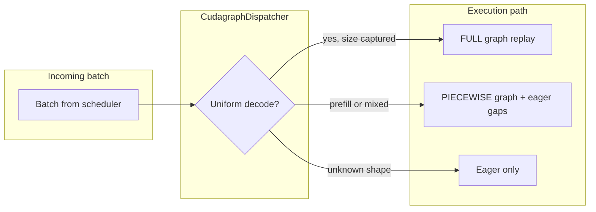
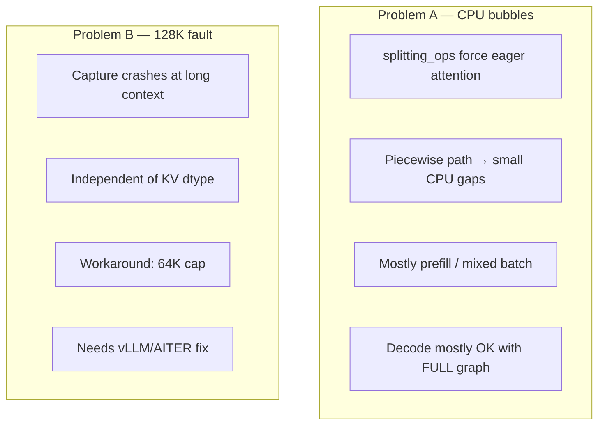

# Kimi-K3 (vLLM, MI355X) — CUDA graph capture, CPU bubbles, and what you can fix

**Audience:** complete beginners. No prior vLLM or CUDA Graphs knowledge assumed.

**What this doc covers:**

1. [How vLLM graph capture works](#part-1--how-vllm-cuda-graph-capture-works-beginner) (plain English)
2. [What happens on K3, layer by layer](#part-2--what-k3-actually-does-one-decoder-layer)
3. [Our trace investigation](#part-3--the-investigation-cpu-bubbles-before-all-reduce) (numbers from the 8k profile)
4. [Easy fixes vs hard fixes](#part-4--easy-fixes-vs-hard-fixes-honest-list)
5. [A second, unrelated capture bug](#part-5--separate-problem-the-128k-capture-gpu-fault) (the 64K context cap)

Related: [kimik3_beginner_tutorial.md](kimik3_beginner_tutorial.md) Part 9, [kimik3_open_issues_todo.md](kimik3_open_issues_todo.md).

---

## Part 0 — Three words you need first

| Term | One sentence |
|---|---|
| **GPU kernel** | A function that runs on the GPU (matrix multiply, attention, all-reduce, …). |
| **Launch** | The CPU telling the GPU “run this kernel now.” Each launch has small overhead. |
| **CUDA Graph** | Record a *fixed sequence* of kernel launches once; later **replay** the whole sequence with one cheap launch instead of thousands of CPU dispatches. |

**Why vLLM cares:** K3 has **93 layers**. Decode = one new token per step × 93 layers × many kernels per layer. Without graphs, the **CPU** becomes the bottleneck just *launching* work, even when the **GPU** has spare capacity.

**The catch:** CUDA Graphs only work when the sequence is **identical every time** — same ops, same shapes, same memory addresses. Anything dynamic (variable batch size, growing KV cache, attention with new tokens) breaks or complicates capture.

---

## Part 1 — How vLLM CUDA graph capture works (beginner)

### The restaurant analogy

Think of the GPU as a kitchen and the CPU as the waiter.

| Mode | What happens each decode step |
|---|---|
| **Eager (no graph)** | Waiter runs to the kitchen **93 times per layer** — “cook norm”, “cook attention”, “cook MoE”, “cook all-reduce”, … Slow waiter = idle kitchen between orders. |
| **CUDA Graph** | Waiter writes down the full 93-layer menu **once**, then each step just shouts **“same order as #7!”** Kitchen starts immediately. |

vLLM’s job is to figure out **which parts of the menu can be pre-written** and which must stay **cook-on-demand** (eager).

### vLLM’s graph modes (the knob we use)

Our K3 agentic recipe sets:

```bash
--compilation-config '{"mode":3,"cudagraph_mode":"FULL_AND_PIECEWISE"}'
```

| Mode | Plain English | When vLLM uses it |
|---|---|---|
| `NONE` | No graphs — everything eager | Debugging |
| `PIECEWISE` | Graph **pieces** around attention; attention itself eager | Mixed prefill+decode, weird batch shapes |
| `FULL` | One big graph for the whole forward (when possible) | Uniform decode batches (all requests generating 1 token) |
| `FULL_DECODE_ONLY` | FULL for pure decode only; prefill always eager | Prefill/decode disaggregated setups |
| **`FULL_AND_PIECEWISE`** | **Both** — FULL when it can, PIECEWISE otherwise | **Default for performance; what K3 uses** |

On K3 startup, vLLM **captures** graphs ahead of time for specific batch shapes (called **capture sizes**). Our engine logged roughly:

- **PIECEWISE graphs:** 11 variants (batch sizes up to **64**)
- **FULL graphs:** 7 variants (batch sizes up to **32**)

At **runtime**, a small controller called the **CudagraphDispatcher** looks at each incoming batch and picks:

```
Is this a uniform decode batch (everyone generating 1 token)?
  YES, batch ≤ 32  →  try FULL graph  (best TPOT)
  NO (prefill or mixed)  →  PIECEWISE graph  (attention stays eager)
  No matching captured shape  →  NONE (fully eager)
```



### What is a “splitting op”?

vLLM **intentionally cuts** the graph at certain operations called **`splitting_ops`**. These ops always run **eager** (CPU-launched), not inside the graph.

**Why cut there?** Attention and KV-cache updates change shape every token / every prefill chunk. vLLM keeps them eager so correctness is preserved.

For K3, the splitting ops that matter (from our engine config) are:

| vLLM op (CPU-side name) | K3 layer type | Runs eager? |
|---|---|---|
| `vllm::unified_mla_attention_with_output` | MLA attention (~24 layers) | **Yes** — biggest bubble source |
| `vllm::linear_attention` | KDA attention (~69 layers) | **Yes** |
| `vllm::unified_kv_cache_update` | KV writes | **Yes** |
| `vllm::unified_mla_kv_cache_update` | MLA KV writes | **Yes** |
| `vllm::hpc_rope_norm_forward` | RoPE / norm | **Yes** (if used) |
| `vllm::sparse_attn_indexer` | Sparse indexing | No — K3 doesn't use these |

*(Full vLLM default list has ~14 attention-related ops; K3 only hits the MLA + KDA rows above.)*

**GPU kernels you see when those ops run eager:**

| Phase | Eager CPU op | GPU kernels launched |
|---|---|---|
| MLA prefill | `unified_mla_attention_with_output` | `fmha_fwd_hd192_hd128_*`, `merge_attn_states`, `_attn_res_kernel` |
| MLA decode | same | `_mla_gluon` or **TRITON_MLA** |
| KDA any | `linear_attention` | `chunk_gated_delta_rule_*`, `chunk_kda_*`, `_causal_conv1d_*`, … |

**What stays inside the graph** (no CPU gap between these):

- `add_rmsnorm_quant_kernel`
- MoE expert matmuls (`mfma_moe1`, `mfma_moe2`)
- `cross_device_reduce_2stage` (TP all-reduce) — on the captured path
- `execute_context_X_generation_Y` — the **whole graph replay** marker in the profiler

---

## Part 2 — What K3 actually does (one decoder layer)

### Pure decode, batch ≤ 32 — the happy path (FULL graph)

When every concurrent request is decoding exactly one token and batch size matches a captured FULL graph:

```
┌─────────────────────────────────────────────────────────────┐
│  ONE graph replay: norm → proj → attn → MoE → AR → …       │
│  (execute_context_*_generation_*)                           │
└─────────────────────────────────────────────────────────────┘
```

CPU overhead is minimal. This is why agentic **steady decode** can hit ~22 ms TPOT — graphs are doing their job.

### Mixed prefill + decode — the piecewise path (our 8k profile)

Agentic turn 10 with 45K new tokens = mostly **prefill**. Chunked prefill can also mix prefill and decode in one batch. That forces **PIECEWISE**:

```
[GRAPH: norm, q/k/v projections]
        ↓ CPU handoff (~35 ms in prefill, ~17 µs in decode)
[EAGER: unified_mla_attention_with_output  →  GPU: fmha / _mla_gluon]
        ↓ CPU handoff
[GRAPH: o_proj, MoE, all-reduce]
        ↓ tiny CPU gap (~17 µs) before AR
[GPU: cross_device_reduce_2stage]
```

× **93 layers** per forward step.

**Prefill is never graph-captured** in vLLM today — variable sequence length. So any profile that is mostly prefill (like our 8k-in / 64-out capture) will show large eager-attention stalls. That is **expected**, not a misconfiguration.

---

## Part 3 — The investigation: CPU bubbles before all-reduce

*This section is the original analysis — now with context from Parts 0–2.*

### Question

The conc32 8k/1k profile shows Communication (AITER `cross_device_reduce_2stage`) at **34.3%**. Hypothesis: that is inflated by a **CPU bubble before the AR**, caused by CUDA-graph capture not covering some ops.

### Method

rank0 torch trace (`dp0_pp0_tp0…rank0`, 548,419 kernels, 26,150 ms span). Measured per-stream inter-kernel idle gaps on the main compute stream, attributed each gap to the kernel that runs *after* it, then correlated the gap windows with CPU-side events (`cpu_op` / `cuda_runtime` / `user_annotation`).

### Finding 1 — the GPU is 92% busy; the bubble is real but not dominant

- Main stream: busy **24,032 ms**, span **26,150 ms** → **idle 8.1% (2,117 ms)**.
- Idle attributed to the kernel after the gap:

| idle | #gaps | ~per-gap | kernel after the gap |
|---:|---:|---:|---|
| **1,512 ms** | 43 | ~35 ms | **`merge_attn_states`** (MLA attention) |
| **275 ms** | 16,182 | ~17 µs | **`cross_device_reduce_2stage`** (the AR) |
| 135 ms | 9,991 | ~13 µs | `at::native::vectorized_elementwise` |
| 42 ms | 4,214 | ~10 µs | `Cijk_` (dense GEMM) |

So there **is** a CPU bubble right before the AR (275 ms, 16k occurrences ≈ one per layer per step), but the **bigger** stall is before MLA attention (1,512 ms in 43 huge ~35–60 ms gaps).

**Beginner read:** the GPU is not “broken” — it is waiting for the CPU to finish launching the *previous* eager op. The 34% AR number is mostly **real all-reduce work + spin-wait**, not empty GPU time.

### Finding 2 — what sits in the bubbles (CPU-side correlation)

**Before `merge_attn_states` (the 1,512 ms prefill stall):**

| CPU time in window | count | op |
|---:|---:|---|
| **1,511.7 ms** | 38 | **`vllm::unified_mla_attention_with_output`** ← eager MLA attention |
| 54.7 ms | 37 | `hipModuleLoadDataEx` ← JIT kernel loading, cold-start only |
| (per-window) | | `execute_context_2(408x)_generation_N` (prefill-chunk markers) |

**Before `cross_device_reduce_2stage` (the 275 ms per-AR bubble):**

| CPU time in window | count | op |
|---:|---:|---|
| 81.7 ms | 4920 | `vllm::moe_forward_shared` |
| 42.1 ms | 2564 | `vllm::rocm_aiter_fused_moe` |
| 39.9 ms | 2443 | `aiter::fused_moe_` |
| 39.2 ms | 2939 | `vllm::rocm_unquantized_gemm` |
| 25.6 ms | 2133 | `aiter::gemm_a16w16` |
| 18.9 ms | 1145 | `vllm::unified_mla_attention_with_output` |
| 15.7 ms | 989 | `vllm::all_reduce` (AR launch dispatch) |

The GPU idles before each AR while the **CPU eagerly dispatches** MoE, dense GEMM, and attention — none of which are inside the graph on the **piecewise / mixed-batch** path.

### Finding 3 — root cause: `FULL_AND_PIECEWISE` + `splitting_ops`

From the engine config:

- `cudagraph_mode: FULL_AND_PIECEWISE`
- `use_inductor_graph_partition: False`
- `enable_chunked_prefill: True`
- Captured: **PIECEWISE=11 (≤64)**, **FULL=7 (≤32)**

**Mechanism:** with chunked prefill and 8k input, batches are **mixed prefill+decode** → **PIECEWISE** path. Each layer:

```
[graph piece] → EAGER attention/KV → [graph piece: o_proj, MoE, AR]
```

The eager splitting-op returns control to the CPU → GPU idles briefly before the next graph piece fires.

### Answer (short)

| Claim | Verdict |
|---|---|
| CPU bubbles exist | **Yes** — ~17 µs before each AR on piecewise path; ~35–60 ms before MLA prefill |
| Caused by graph capture design | **Yes** — `splitting_ops` are *supposed* to be eager |
| AR 34% is mostly bubble | **No** — mostly real all-reduce + cross-rank spin-wait; bubble is ~275 ms / 26 s ≈ **1% of span** |
| Affects agentic decode TPOT | **Mostly no** — pure decode at batch ≤32 uses FULL graph; bubbles are a **prefill / mixed-batch** story |

### Important caveat — prefill-dominated window

This profile is 8k in / **OSL=64** → mostly prefill. In steady **pure decode** at batch ≤32, the FULL graph covers attention + AR in one replay → per-AR bubbles largely disappear.

---

## Part 4 — Can we actually improve graph capture? (code-verified levers)

Short answer: **yes, there are three real levers**, and one of them is a feature our own recipe currently
turns off. All claims below were checked against the local vLLM checkout (`~/work/vllm`), not guessed.

### Lever 1 — Breakable CUDA graph (`VLLM_USE_BREAKABLE_CUDAGRAPH=1`) ★ biggest

vLLM has a newer capture strategy that exists *specifically* to solve "attention can't be captured, so we
pay a CPU launch bubble at every layer." Source: `vllm/compilation/breakable_cudagraph.py`.

**How the two strategies differ:**

| | **Piecewise (what we run today)** | **Breakable** |
|---|---|---|
| How the split happens | `torch.compile` / Dynamo pre-splits the model into FX subgraphs at every attention op | One capture context drives the **whole forward**; attention ops intercept at the dispatcher to end capture, run eager, resume capture |
| Captured artifact | Many compiled subgraphs, each with its own `CUDAGraphWrapper` | A **flat list of zero-arg callables** (`graph.replay` bound methods + eager fns) |
| Replay cost per layer | Wrapper dispatch + dict lookup + Python per piece | `for r in self.segments: r()` |
| Depends on torch.compile | Yes | **No** |

The eager attention still runs eagerly on replay — that part is unavoidable. What breakable removes is the
**per-piece Python/dispatch overhead**, which on a **93-layer** model is paid ~93× (or ~186×, counting KV
updates) per forward step. That is exactly the ~17 µs × 16,182 gaps we measured.

**Status on K3 — one op is missing the hook:**

| K3 op | File | `@eager_break_during_capture`? |
|---|---|---|
| `vllm::unified_mla_attention_with_output` | `model_executor/layers/attention/mla_attention.py:1203` | **Yes** ✅ |
| `vllm::unified_attention_with_output` | `model_executor/layers/attention/attention.py:816` | Yes ✅ |
| `vllm::sparse_attn_indexer` | `model_executor/layers/sparse_attn_indexer.py:295` | Yes ✅ |
| **`vllm::kda_attention`** | `model_executor/layers/mamba/gdn/kimi_gdn_linear_attn.py:43` | **NO** ❌ |

K3's **KDA layers are the majority of the model** (~69 of 93). Without the decorator, enabling breakable
capture today would let MLA break correctly while KDA gets pulled **inside** the graph — KDA reads
per-request `GDNAttentionMetadata` and updates recurrent state, so that is unsafe (expect a crash or wrong
output, not a speedup).

**The fix is small and the precondition is already met.** The decorator requires the op to write into a
caller-provided output buffer, and `kda_attention` already registers with `mutates_args=["core_attn_out"]`:

```python
# vllm/model_executor/layers/mamba/gdn/kimi_gdn_linear_attn.py
from vllm.compilation.breakable_cudagraph import eager_break_during_capture

@eager_break_during_capture          # <-- add this (outermost decorator)
def kda_attention(
    q_proj_states: torch.Tensor,
    ...
    core_attn_out: torch.Tensor,     # in-place output — precondition satisfied
    layer_name: str,
) -> None:
```

**Action:** patch `kda_attention`, then A/B `VLLM_USE_BREAKABLE_CUDAGRAPH=1` vs `0` on decode TPOT.
Upstreamable as a one-line vLLM PR. **Untested — validate correctness before trusting any perf number.**

> Note: our recipe sets `VLLM_USE_BREAKABLE_CUDAGRAPH=0` explicitly (inherited from the day-0 MI355X
> recipe, where it was set for **capture stability**). That was the right call before KDA had the hook;
> revisit it after the patch.

### Lever 2 — Inductor graph partition (`use_inductor_graph_partition: true`)

This directly addresses the **KV cache update ops** in your list.

Today (`use_inductor_graph_partition: False`), vLLM **appends** the KV update ops to `splitting_ops`
(`config/compilation.py:1174-1175`):

```python
if not self.use_inductor_graph_partition:
    self.splitting_ops.append("vllm::unified_kv_cache_update")
    self.splitting_ops.append("vllm::unified_mla_kv_cache_update")
```

So we pay **two extra graph breaks per layer** purely because of a Dynamo limitation (an Inductor
graph-reuse issue with a string parameter — vLLM issue #33267), not because KV updates are inherently
uncapturable.

Switching it on:

| Benefit | Detail |
|---|---|
| KV update ops **stay inside** graph pieces | They are no longer appended to `splitting_ops` |
| Partition happens **after** all passes/fusions | Custom passes see the whole graph → better fusion |
| Unlocks ROCm AITER fusions | `fuse_rope_kvcache`, `fuse_qk_norm_rope_kvcache` are **currently auto-disabled with a warning** on our config |
| One compile serves both | Full and piecewise capture without compiling twice |

Requires **torch ≥ 2.9.0.dev** (hard `ValueError` otherwise).

```bash
--compilation-config '{"mode":3,"cudagraph_mode":"FULL_AND_PIECEWISE","use_inductor_graph_partition":true}'
```

**Check the server log for these two warnings** — if present, we are leaving those fusions on the table:

```
fuse_rope_kvcache is enabled, but splitting_ops is None and Inductor graph partition is not enabled.
```

### Lever 3 — `TRITON_MLA` is what caps our graph coverage

vLLM resolves capture mode from the **minimum** capability across all attention backends
(`gpu_model_runner.py:_check_and_update_cudagraph_mode`). Declared support levels:

| Backend | `AttentionCGSupport` | Level |
|---|---|---:|
| **`TRITON_MLA`** (our fp8 path) | `UNIFORM_SINGLE_TOKEN_DECODE` | **1** ← limiter |
| `ROCM_AITER_MLA` (bf16 gluon) | `UNIFORM_BATCH` | 2 |
| KDA / GDN backend | `UNIFORM_BATCH` | 2 |
| `TRITON_ATTN`, FA3 | `ALWAYS` | 3 |

Consequences:

- FULL graphs only for **query_len == 1** pure decode. Adequate for the agentic baseline today.
- **DSpark speculative decode would lose FULL graphs.** Spec decode makes query_len = `1 + num_spec_tokens`,
  which needs `UNIFORM_BATCH` (level 2). On `TRITON_MLA` those batches fall back to **PIECEWISE** — so the
  per-AR bubble returns exactly where spec decode needs low latency. Worth checking before we benchmark DSpark.
- Fixing this means AITER gluon fp8 supporting batched decode (already tracked as a P0), which would let fp8
  run on a level-2 backend.

### Lever 4 — capture size coverage ("widegraph")

`max_cudagraph_capture_size` defaults to `min(max_num_seqs * 2, 512)`, and our recipe sets
`MAX_NUM_SEQS = 2 × CONC`. At **CONC=4** that means `max_num_seqs=8` → capture sizes only up to **16**,
FULL graphs up to **8**.

Agentic traffic fluctuates (subagent spawns, tool-call turns), so it is worth confirming from the log that
real batches land on captured sizes rather than dispatching to `NONE` (fully eager). On gpt-oss/MI355X, the
`widegraph` config — larger capture window plus more `compile_sizes` — measurably removed host-side jitter
([BLOG_gptoss120b_mi355x.md](../../vllm_gptossblog/BLOG_gptoss120b_mi355x.md)).

### Correction to note

K3's KDA layers register **`vllm::kda_attention`** (`kimi_gdn_linear_attn.py`), not `vllm::linear_attention`
as earlier drafts of this doc stated. Both appear in vLLM's default `_attention_ops`, so the piecewise
behavior is the same — but the distinction matters when writing a patch. Confirm against the engine's
`splitting_ops` log line for the exact image being served.

### Priority order

| # | Lever | Effort | Confidence | Blocking issue |
|---:|---|---|---|---|
| 1 | Patch `kda_attention` + test breakable cudagraph | ~1 line + A/B run | Medium-high mechanism, **unmeasured** | none |
| 2 | `use_inductor_graph_partition: true` | config flag | Medium | torch ≥ 2.9.0.dev |
| 3 | Verify capture-size coverage / widen | config flag | Medium | none |
| 4 | Decode-only profile to establish the real baseline | profiling run | High value | none |
| 5 | Backend level-2 support for fp8 MLA | upstream AITER | Low near-term | P0 gluon batch=1 assert |

**Measure first:** all of the above target the *piecewise* path. Per Part 3, pure decode at batch ≤32 already
uses FULL graphs, so the honest expected win is on **prefill / mixed-batch (TTFT)** and on **spec-decode**
paths — not necessarily on steady-state agentic TPOT. Get the decode-only trace before investing.

---

## Part 4b — Other fixes (broader list)

### Easy — do these first

| Fix | What it does | Expected gain | Risk |
|---|---|---|---|
| **Warmup before profiling / serving** | Runs kernels once so `hipModuleLoadDataEx` (JIT load) doesn't pollute traces | Removes ~55 ms cold-start spikes in prefill bubbles | None |
| **Keep `FULL_AND_PIECEWISE`** | Already our recipe | Best decode TPOT vs `PIECEWISE`-only or `NONE` | Needs memory for captured graphs |
| **Keep `VLLM_USE_BREAKABLE_CUDAGRAPH=0`** | Stable capture on ROCm | Avoids capture corruption | Already set in recipe |
| **Profile decode-only, not 8k prefill** | Measure where agentic TPOT actually lives | Stops chasing prefill-only bubbles | Needs a segmented trace pass |
| **Serve with `--enable-prompt-tokens-details`** | Measure real prefix-cache hits | Lowers TTFT if cache works; not a graph fix | None |

**There is no secret `--capture-attention` flag.** Attention is eager **by design** in piecewise mode.

### Medium — recipe / config trade-offs

| Fix | Trade-off |
|---|---|
| **`KV_CACHE_DTYPE=auto` (bf16 KV)** | Native ~1M context captures cleanly; decode ~2× slower per token (large KV read). See [kimik3_ref_config_vs_ours.md](kimik3_ref_config_vs_ours.md). |
| **`--enforce-eager`** | Removes all graph capture issues | **Destroys decode TPOT** on 93-layer K3 — rejected for production |
| **`FULL_DECODE_ONLY` mode** | Saves memory vs FULL_AND_PIECEWISE | Agentic has prefill every turn — you still need piecewise for TTFT |
| **Lower concurrency** | More batches hit FULL graph (≤32) | Throughput drops |
| **Dense GEMM tuning** (hipBLASLt) | ~22% GPU time, 8.5K untuned fallbacks | Orthogonal to graphs but real decode win — see [profile doc](kimik3_fp4_mi355x_conc32_vllm_profile.md) |

### Hard — needs upstream vLLM / AITER / backend work

| Fix | Why it's hard |
|---|---|
| **Make MLA/KDA attention graph-safe** | Shapes change every token; KV layout updates; TRITON_MLA / gluon backends declare limited CUDA Graph support |
| **Remove attention from `splitting_ops`** | Requires attention backend with `AttentionCGSupport.ALWAYS` *and* static-shape capture on ROCm for K3's dense MLA + KDA hybrid |
| **Fix ≥128K capture GPU fault** | Separate bug — memory fault during capture, not CPU bubble. Blocks context > 64K. See [Part 5](#part-5--separate-problem-the-128k-capture-gpu-fault). |
| **Reduce TP all-reduce volume** | Sequence parallelism / fewer ARs — architectural, not a graph toggle |
| **Fix R0/R1 vs R2–R7 elementwise skew** | Possible NUMA/XCD placement; ~13% imbalance masked by AR spin-wait |

### What we would **not** recommend

| Idea | Why |
|---|---|
| Set `splitting_ops: []` without backend support | vLLM may downgrade to `FULL` or break capture; attention must support full-graph |
| Disable chunked prefill to " simplify" graphs | Hurts long agentic TTFT |
| Treat 34% AR in an 8k **prefill** profile as the decode bottleneck | Misleading — re-profile decode |

---

## Part 5 — Separate problem: the ≥128K capture GPU fault

This is **not** the CPU bubble issue. It is a **crash during graph capture** at long context.

| Symptom | Detail |
|---|---|
| When | `max-model-len` ≥ **128K**, during startup capture (FULL or PIECEWISE) |
| Backends hit | `TRITON_MLA` (fp8) and AITER `_mla_gluon` / bf16 gluon |
| Error | GPU memory fault |
| Works | ≤ **64K** context with graphs enabled |
| Bad workaround | `--enforce-eager` (no fault, terrible TPOT) |
| **Our workaround** | Cap agentic serve at **64K** |

So K3 on MI355X has **two graph-capture stories**:



---

## Part 6 — Implications / next steps

1. **Confirm on a decode-only trace.** Check whether FULL graph removes the ~17 µs pre-AR bubble. If yes, decode AR cost is real comm, not launch overhead.
2. **Warmup before profiling.** Strip `hipModuleLoadDataEx` from prefill bubble measurements.
3. **Don't optimize AR from prefill profiles.** At 8k×conc32, wide activations make AR legitimately large (37% comm/total in prefill — see [tp8 rank imbalance](kimik3_tp8_rank_imbalance.md)).
4. **Track upstream fixes** for ≥128K capture fault and AITER gluon batched fp8 — those unlock context, not micro-bubbles.
5. **Dense GEMM tuning** is the highest-yield *easy-ish* win on the decode path today.

---

## Glossary

| Term | Meaning |
|---|---|
| **Eager** | Normal PyTorch: CPU launches each kernel one by one |
| **Capture** | First run records the kernel sequence into a graph object |
| **Replay** | Later runs re-use the recorded sequence |
| **Piecewise** | Multiple smaller graphs with eager gaps between them |
| **FULL** | One graph for (almost) the entire forward pass |
| **Uniform decode** | Every request in the batch generates exactly 1 token this step |
| **Mixed batch** | Some requests prefilling, some decoding — common in agentic serving |
| **Bubble** | GPU idle time waiting for CPU to launch the next op |
| **Spin-wait** | Fast GPU ranks waiting at all-reduce barrier for slow ranks |

---

## Artifacts

- Trace: `xguo-k3:/workspace/kimik3_traces/dp0_pp0_tp0…rank0.pt.trace.json.gz` (+ ranks 1–7)
- Scripts: `bubble_k3.py` (gap→next-kernel), `bubble_cpu_k3.py` (gap→CPU-op correlation)
- Recipe: `benchmarks/single_node/agentic/kimik3_fp4_mi355x_vllm.sh`
- Upstream vLLM design doc: `vllm/docs/design/cuda_graphs.md`
