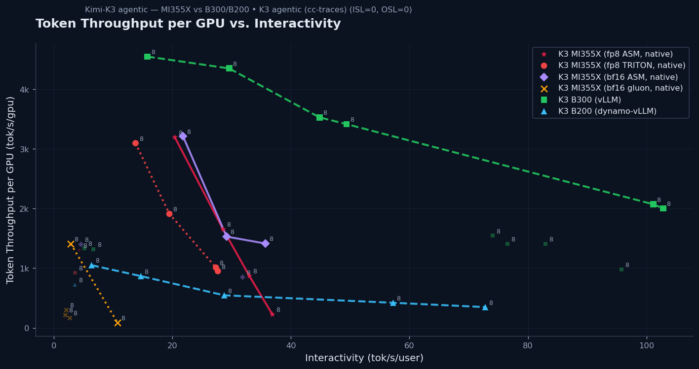

# Kimi-K3 agentic Pareto — MI355X vs B300 vs B200



**Axes:** x = Interactivity (1000 / mean TPOT, tok/s/user); y = Token Throughput per GPU (total tok/s ÷ 8).
Engine `plot_pareto_3way.plot_combined`; generated by `plot_kimik3_pareto.py`.

## Series (all K3, TP8, agentic cc-traces, native context)
| Series | KV | decode kernel |
|---|---|---|
| **MI355X bf16 ASM** ← best MI355X | bf16 | **ASM 576/512** (`mla_dec_stage1_bf16`, patched dispatch) |
| MI355X fp8 (native) | fp8 | TRITON_MLA (generic) |
| MI355X bf16 gluon | bf16 | gluon `bh16bn64` (degraded — see below) |
| B300 (vLLM) | fp4 | (NVIDIA) |
| B200 (dynamo-vLLM) | fp4 | (NVIDIA) |

## MI355X sweep (tput/gpu, TPOT, interactivity)
| conc | **bf16 ASM** | fp8 TRITON | bf16 gluon |
|---:|---|---|---|
| 1 | 1909, 28.6 ms, 35.0 | 951, 36 ms, 27.7 | 86, 92.9 ms, 10.8 |
| 4 | 937, 30.0 ms, 33.3 | 1012, 37 ms, 27.4 | 173, 371 ms, 2.7 |
| 8 | 1883, 34.9 ms, 28.7 | 1912, 51 ms, 19.5 | 1412, 350 ms, 2.9 |
| 16 | **3588, 52.0 ms, 19.2** | 3097, 72 ms, 13.8 | 217, 514 ms, 1.9 |
| 24 | 1222, 218 ms, 4.6 | 925, 278 ms, 3.6 | 299, 483 ms, 2.1 |

## Key finding — the ASM 576/512 decode patch is the biggest MI355X win
- **bf16 ASM is the best MI355X config** — it beats **fp8-TRITON_MLA** (e.g. conc16: 3588 vs 3097 tok/s/gpu,
  52 vs 72 ms TPOT) *and* the old **bf16-gluon** by ~10× in the agentic workload.
- Why so much better than bf16-gluon? The fast ASM decode is quick enough to **avoid the KV-pressure
  queueing cascade** that wrecked gluon at conc≥4 (gluon TTFT ballooned to 40 s+; TPOT 350–514 ms). With
  the ASM kernel, decode drains fast → no cascade → clean 28–52 ms TPOT.
- Why bf16-ASM > fp8-TRITON? **Kernel efficiency beats KV-dtype here**: the C++ ASM 576/512 decode
  outperforms the generic TRITON_MLA by more than fp8's ~2× bandwidth saves. (Controlled 8k/256 A/B:
  bf16-ASM 42 ms vs bf16-gluon 49 ms = +15% raw; in agentic the cascade-avoidance makes it far larger.)
- **B300 still leads** at high interactivity (its frontier reaches ~100 tok/s/user; MI355X full-context
  decode tops out ~35), but **bf16-ASM closes much of the mid-concurrency gap** (conc16: 3588 vs B300 ~4351).
- **conc24 is the capacity ceiling** for all MI355X configs (KV pool saturates at full context → TTFT
  spikes); usable range is ~conc16.

## The ASM decode patch (validated)
K3 has **12 MLA heads/rank** (< the 16-head `_AITER_MIN_MLA_HEADS`), so vLLM routed it to gluon (fp8=batch1)
and the ASM 576/512 kernel (gated to %16 heads) was unreachable. The patch (`rocm_aiter_mla_asm_pad.py`,
installed in the container):
1. **replicate-pad 12→16 heads** in `get_mla_padded_q`/`get_mla_unpadded_o` (append copies of real heads;
   *not* zeros — zero-pad produced garbage output), and
2. route single-token decode to the ASM path (`use_gluon_decode → False`).
Correctness verified (primes → "2, 3, 5, 7, 11", etc.). bf16 only today; **fp8-ASM needs an fp8
`mla_dec_stage1` kernel in aiter** (Part A) — that would stack ASM speed *on top of* fp8 bandwidth and
should be the strongest config of all.

## Low-conc tput/gpu is a metric artifact (not a bug)
Rebenched bf16-ASM at **900 s** (vs 600 s): **TPOT/interactivity became clean and monotonic**
(conc 1→16: 28→31→34→46 ms; interact 35.7→31.9→29.2→21.8). But **tput/gpu stays jumpy at low conc**
(conc1 1415 > conc4 850 < conc8 1530). Reason: `tput/gpu` = *total* (input+output) tokens/s is
**prefill-dominated**, and at low conc only `conc` trajectory lanes run — the number of requests that
complete (hence total input churned) depends on the sampled trajectories' *output* lengths. conc4
drew long-output trajectories → only 97 reqs completed (vs conc1's 126) → less total input → lower
total-tput. It's a workload/metric characteristic (the NVIDIA dashboard avoids it with far longer runs
+ more lanes), not a decode-kernel issue — the **latency metrics are the reliable low-conc signal**.

## Caveats
- Short-ish runs on real cc-traces → low-conc tput/gpu noise (see above). conc24 = capacity outlier.
- Different KV/stack per series; directional vs NVIDIA. conc1 (bf16/fp8) used `--random-seed 0`
  (seed 42's conc1 lane is unspawnable — `EmptyTracePoolError`).

## Reproduce
```
python3 plot_kimik3_pareto.py   # reads k3_bf16asm_sweep_c* + k3_fp8native_sweep_c* + k3_bf16_sweep_c* + /tmp/k3_b300.json
```
